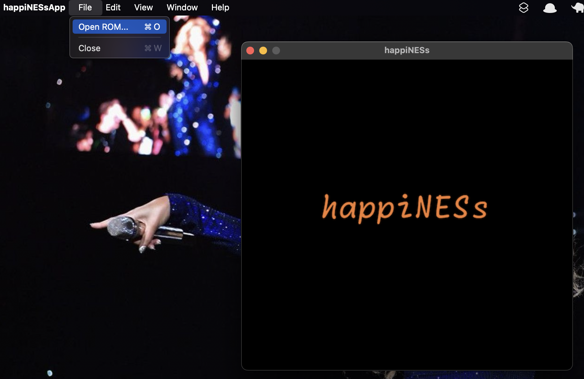
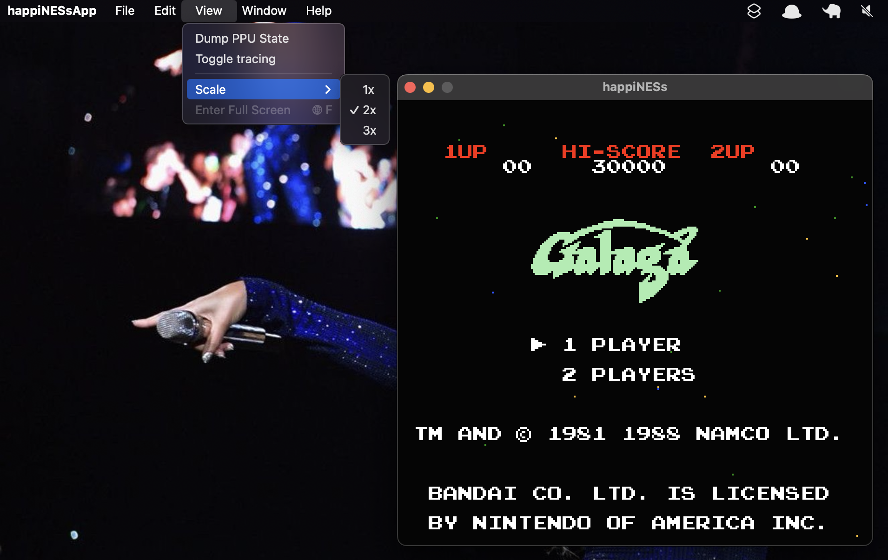
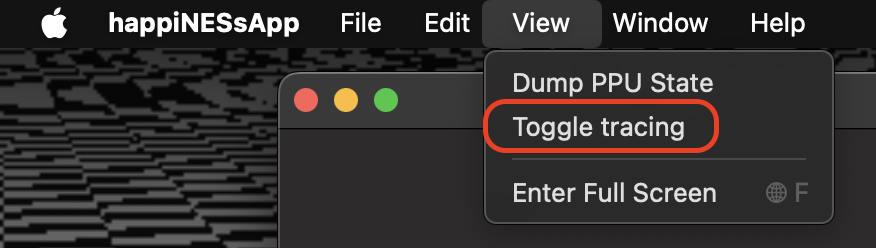
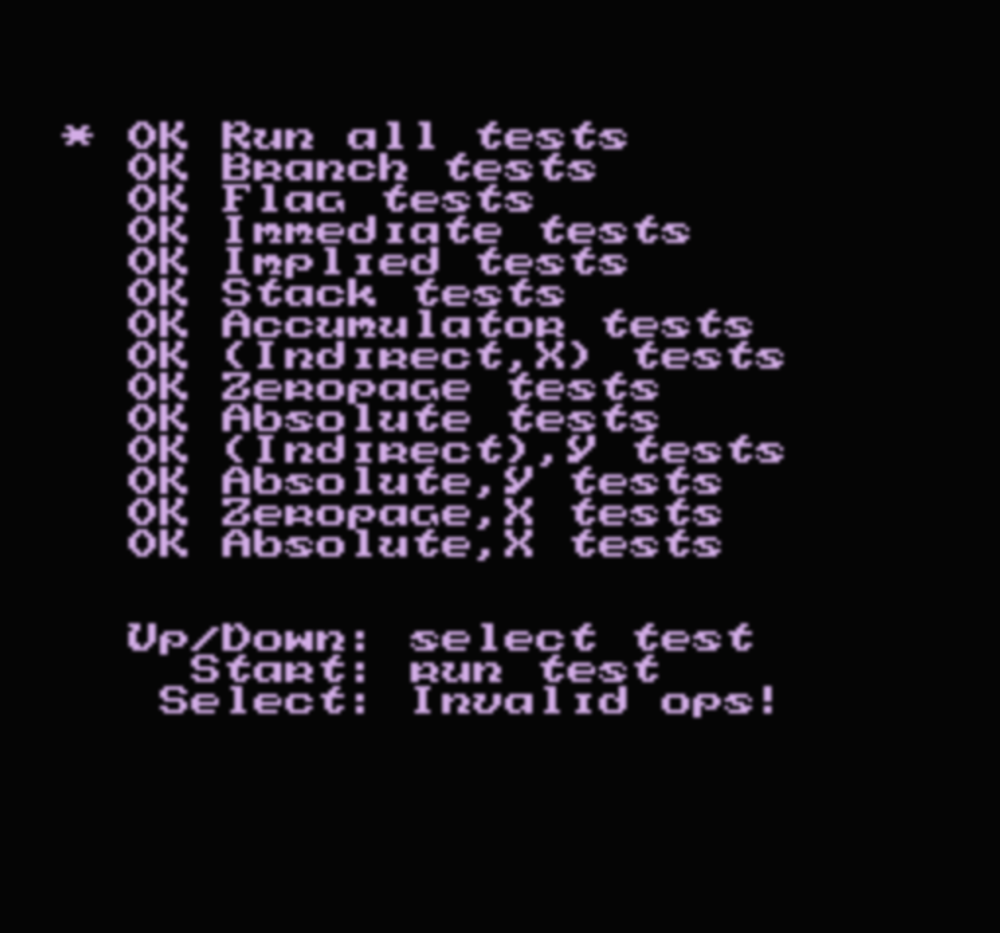

# Purpose

I've been wanting to build an emulator for _years_ without knowing how on earth to approach doing so. I had already built a small Chip-8 emulator but it was so limited in graphical capabilities and there are so few games or other other useful software available for it. As a result, I got a little bored with that project, and wanted to work on something more substantial and most likely an actual game console. However, finding a platform to emulate that wouldn't be too difficult for a newbie like me was itself difficult! Even amongst consoles and computers from the early 1980s, I had read that most of them were actually quite difficult as a first foray into emulation. Then I finally came across this tutorial, <a href="https://bugzmanov.github.io/nes_ebook/">https://bugzmanov.github.io/nes_ebook/</a>, that was 1) very friendly to someone unfamiliar with this topic, 2) wasn't just a series of YouTube videos and instead had actual step-by-step written content, as well as provided example source code, and 3) showed you how to build about 90% of the system. And so, this project was borne out of that discovery...

# Building and usage

Check out the project using git. Then open it up using Xcode and run the project by hitting ⌘-R. That should start up a small GUI within which you can open and load a ROM file from your file system:



ROM files must be in NES 2.0 format or earlier. If the ROM's mapper is not in the list below, you will get an error. However, if you open a valid ROM file, the game should load and you should see the title screen for that game, and be able to immediately start playing it. You can load a new ROM file at any time even after selecting and playing one.

Keys are mapped to joypad buttons in the following manner:

```
    ┌-------------------------------------------------------------┐
    |           ↑                                                 |
    |         ┌---┐                                               |
    |         |   |                                               |
    |     ┌---┘   └---┐                                           |
    |  ←  |           |  →                      /‾‾‾\   /‾‾‾\     |
    |     └---┐   ┌---┘     ┌-----┐ ┌-----┐    |     | |     |    |
    |         |   |         └-----┘ └-----┘     \___/   \___/     |
    |         └---┘         return   space        S       A       |
    |           ↓                                                 |
    └-------------------------------------------------------------┘

```

You can also specify the scale of the screen between 1x, 2x, and 3x through the View menu of the app:



... or through hitting ⌘-1, ⌘-2, or ⌘-3, respectively. Alternately, if you are on macOS 15.1 or later, you can run the game in fullscreen mode by selecting the "Enter Full Screen" choice from the View menu or via hitting the 🌐-F chord.

Hitting ⌘-R within happiNESs at any time while playing a game will reset it. You can also pause any game at any time by hitting ⌘-P; hitting that chord again will unpause it.

# Supported games

So far, the following mappers and associated games have been tested in this emulator and are largely playable:

- 000
  - 1941
  - Donkey Kong
  - Galaga
  - Galaxian
  - Ms. Pacman
  - Pacman
  - Super Mario Bros.
  - Xevious
- 001
  - Castlevania II
  - Double Dribble
  - Pinball Quest
- 002
  - 1943
  - Blades of Steel
  - Castlevania
- 003
  - Gradius
  - Gyruss
  - Tiger Heli
- 004
  - Astyanax
  - Kirby's Adventure
  - Rampart
- 007
  - Sky Shark
  - Marble Madness
  - Wheel of Fortune

Also, this emulator now supports sound! Games should play and sound _pretty_ close to the original, however certain things like timings and IRQ interrupt handling may not be quite right and will need some work to correct.

# Design

This emulator differs in design quite a bit from that from the tutorial, and I will discuss those decisions below.

### Using Swift instead of Rust

At first, I was inclined to use Rust just like the original author, but to be honest, I personally find Rust code difficult to grok, especially when it comes to expressing lifetimes. And so I decided to use Swift because it is far more familiar to me.

Moreover, I had started out writing code for this emulator by largely translitering things from Rust to Swift, but I soon found myself wanting to take advantage of some of Swift's idioms rather than strictly adhering to Rust's. Doing so just made things easier to express and understand later when going back and reading old code.

### SwiftUI vs. SDL

There may have been a way to use a macOS version of SDL, as the tutorial uses, but I'm a lot more familiar with SwiftUI than I am with SDL, and I felt like it's a lot easier to build applications with the former. It _did_ take a little bit more effort to get started, but once I was able to display graphics in a SwiftUI `Canvas`, then it became fairly trivial to add things like menu items or display dialog boxes upon an error.

And since I had a GUI framework at my disposal, I felt it was worthwile to be able to load and run arbitrary ROM files from within the GUI menu, rather than hardcoding any one ROM file into the code and having to recompile every time I wanted to run a different one, as the Rust tutorial requires.

### Pixel-based rendering

The strategy in the Rust version renders all background tiles and all sprites onto a frame at once. This eventually became difficult to debug problems with, e.g. being able to properly render the HUD in Super Mario Bros. In that game, the HUD should be fixed, because the tutorial's implementation rendered all of the objects at the same time, the _entire_ screen scrolls not just the playing field. A correct implementation waits for the so-called sprite zero hit midway through the screen, resulting in the HUD remaining in place but the playing field to be scrolled. (My current implementation _almost_ gets this right, as the bottom few rows of the HUD still scroll, but there is a GitHub issue open to address this.)

There were also issues regarding properly handling sprites that were supposed to be appear to be rendered _behind_ the background tiles. In the Rust version, all sprites were rendered on top of the background tiles, but in the NES, each sprite has a so-called background priority bit that specifies whether it should effectively rendered on top of a background tile of behind it. Because all sprites were simply rendered regardless of this bit and _after_ the background was already rendered, certain aspects of the game looked odd, such as power-up mushrooms appeared in front of the block instead of looking like it emanted from within it, or at the end of world 1-1,  Mario looks like he stops in front of the pipe instead of actually entering it.

This was all rewritten to be more congruent with the operation of an actual NES, namely that

- For each visible scanline of the screen:
   - Determine which sprites intersect with the scanline and cache them
   - For each pixel on the scanline:
       - If there is a first _foreground_ sprite with a non-transparent color, set the pixel's color accordingly
       - If there is a background tile with a non-transparent color, set the pixel's color accordingly
       - If there is a first _background_ sprite with a non-transparent color, set the pixel's color accordingly
       - If we haven't found any of the above, set the pixel to the main background color

Sprite zero hit detection now happens _while evaluating pixels_ instead of waiting until just before rendering the screen buffer as the implemenation in the Rust tutorial does.

### Usage of enums instead of class hierarchies

As I've done in other projects, I have found enums to be far easier to use for grouping things that share an interface but have slightly different behavior for each case. One of the biggest advantages of them is when being passed an enum and being able to rely on the Swift type checker to make sure client code considers every possible case; you don't get that if you use interfaces (protocols) that a set of things conforms to. 

And so I wound up using one for opcodes, which was _really_ useful in the early stages of this project. I would immediately know if CPU was not looking for any extant opcodes because the compiler would fail and display an error. Similarly, mappers are encapsulated in an enum, and I get the same benefit.

### Tracing and test ROMs

There is a menu item in the GUI that allows you to toggle CPU/PPU tracing on and off:



... and you can do so at any point in the emulation. Turning tracing on results in lines being written out to standard output when launching the app from within Xcode; the format of each line follows that of the canonical `nestest.log` file:

```
C004  78        SEI                             A:00 X:00 Y:00 P:24 SP:FD PPU:  0, 21 CYC:7
C005  D8        CLD                             A:00 X:00 Y:00 P:24 SP:FD PPU:  0, 27 CYC:9
C006  A2 FF     LDX #$FF                        A:00 X:00 Y:00 P:24 SP:FD PPU:  0, 33 CYC:11
C008  9A        TXS                             A:00 X:FF Y:00 P:A4 SP:FD PPU:  0, 39 CYC:13
C009  AD 02 20  LDA $2002 = 00                  A:00 X:FF Y:00 P:A4 SP:FF PPU:  0, 45 CYC:15
C00C  10 FB     BPL $C009                       A:00 X:FF Y:00 P:26 SP:FF PPU:  0, 57 CYC:19
.
.
.
```

Doing this _will slow performance down significantly_ and so is only intended for debugging purposes. 

So far, the following test ROMs all pass:

- nestest.nes
- official\_only.nes
- ppu\_vbl\_nmi.nes
- test\_ppu\_read\_buffer.nes

For example, running `nestest.nes` results in the following:




### Error handling

Since this is a GUI application, most errors result in a dialog box being displayed to the user with a descriptive message instead of simply crashing like the Rust version does. That said, there are some games that could result in a hard crash; I haven't ironed out all of the bugs!

# Unit testing

For the time being, the unit tests are primarily focused on the implementations of the 6502 opcodes. This is admittedly bad, and my hope is that I get around to writing tests to exercise other parts of the codebase.

# Relevant links

- A Rust-based tutorial on building an NES emulator  
  <a href="https://bugzmanov.github.io/nes_ebook/">https://bugzmanov.github.io/nes_ebook/</a>
- Reference guide for the opcodes for the 6502  
  <a href="https://www.pagetable.com/c64ref/6502/?tab=2">https://www.pagetable.com/c64ref/6502/?tab=2</a>
- The indispensible NES Wiki  
  <a href="https://www.nesdev.org/wiki/Nesdev_Wiki">https://www.nesdev.org/wiki/Nesdev_Wiki</a>
- NES ROM directory, listing games and their respective mapper numbers  
  <a href="https://nesdir.github.io/">https://nesdir.github.io/</a>
- A page listing various test ROMS  
  <a href="https://www.nesdev.org/wiki/Emulator_tests">https://www.nesdev.org/wiki/Emulator_tests</a>
- A page with the diassembled source code for Super Mario Bros.  
  <a href="https://6502disassembly.com/nes-smb/SuperMarioBros.html">https://6502disassembly.com/nes-smb/SuperMarioBros.html</a>
- A Go implementation of an NES emulator  
  <a href="https://github.com/fogleman/nes">https://github.com/fogleman/nes</a>
- A page on Apple's Developer web site with an example project that you can download and experiment with to learn how to use part of the AVFAudio framework.  
  <a href="https://developer.apple.com/documentation/avfaudio/audio_engine/building_a_signal_generator">https://developer.apple.com/documentation/avfaudio/audio\_engine/building\_a\_signal\_generator</a>
- GitHub repo with a ROM that comprehensively exercises the APU's sound capabilities.  
  <a href="https://github.com/nesdoug/NES_SOUND">https://github.com/nesdoug/NES_SOUND</a>